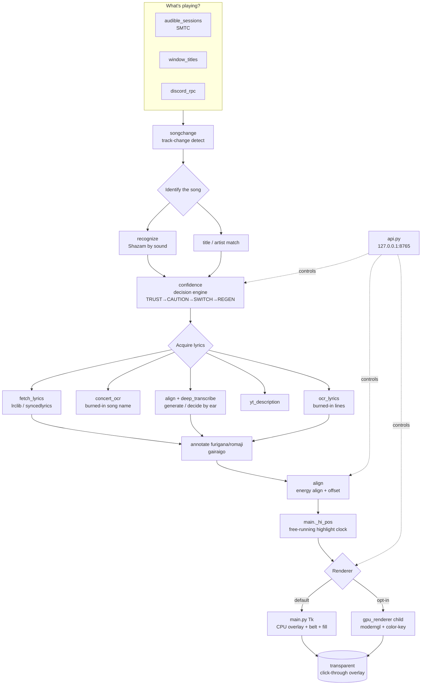

# Deployment Map & Module Guide

A one-stop orientation for a developer: **where everything lives, what each module
does, and how source becomes a running app.** Pairs with
[`ARCHITECTURE.md`](ARCHITECTURE.md) (runtime internals) and
[`BUILD.md`](BUILD.md) (build minutiae).

---

## 1. Repo layout (top level)

```
Desktop-Karaoke/                      ← SOURCE (git: BarnsL/Lyric-Immersion-and-Karaoke, branch master)
├── main.py                           ← the app: Overlay class, _tick render/sync loop, tray, settings
├── <25 app modules>.py               ← imported at runtime (see the Module Map below)
├── DesktopKaraoke.spec               ← PyInstaller recipe (what gets bundled)
├── build.bat                         ← one-shot build (PyInstaller + optional Inno installer)
├── installer.iss                     ← Inno Setup recipe → dist/…-Setup.exe
├── version.py                        ← single source of the version string
├── requirements.txt
├── scripts/                          ← standalone dev/maintenance scripts (see scripts/README.md)
├── packaging/                        ← MSIX packaging (build_msix.ps1) + after-install text
├── docs/                             ← this folder
├── tests/                            ← test suite
├── spikes/                           ← throwaway proofs-of-concept (e.g. the GPU overlay spike)
├── lyrics/                           ← LOCAL lyric cache (gitignored; copyrighted, never committed)
├── build/  dist/  __pycache__/       ← build output (gitignored)
└── bundled_lyrics/                   ← optional baked-in LRCs (gitignored; local-only)
```

**Deployed app** lives separately at **`D:\DesktopKaraoke\`** (exe + `_internal/` +
the runtime `lyrics/  models/  settings.json  *.log`). The deploy folder name stays
`DesktopKaraoke` on purpose — renaming it would orphan the lyric cache / models.

---

## 2. Module Map (the 26 root modules, grouped by function)

### App shell
| Module | Role |
|--------|------|
| `main.py` | The whole app: the `Overlay` Tk window, the `_tick` per-frame render + sync loop, the system-tray menu, settings load/save, and spawning/​feeding the GPU child. The ~11k-line core everything hangs off. |
| `version.py` | Single source of the version string (read by `api.py`, `updater.py`, the build scripts). |
| `appdata.py` | Resolves the data dir / paths (lyric cache, settings, logs). |
| `api.py` | Local HTTP control API on `127.0.0.1:8765` (`/status /tune /nudge /resync /decide /scroll …`) — the "eyes and hands" for driving the app while it runs. |
| `updater.py` | In-app updater (checks GitHub releases, swaps the exe). |

### "What's playing?" — sources
| Module | Role |
|--------|------|
| `audible_sessions.py` | Windows **SMTC** media-session reader: title / artist / position / play-state of the actually-audible session. The primary source. |
| `window_titles.py` | Reads browser / app window titles (Steam overlay, Discord, Slack, generic browsers) as a fallback now-playing source. |
| `discord_rpc.py` | Discord Rich Presence as another now-playing source (Spotify etc.). |
| `songchange.py` | Detects track changes (so a new song wipes lyrics and re-identifies). |
| `youtube_music.py` | YouTube Music / CSV playlist helpers. |

### Song identification & decision
| Module | Role |
|--------|------|
| `recognize.py` | **Shazam**-style sound fingerprint ID (`recognize_playing`) — hears the actual audio and names the song + offset. |
| `confidence.py` | Fuses independent signals into the decision engine (TRUST → CAUTION → SWITCH → REGEN), and owns JP-act detection (`_KNOWN_JA`, the single source of truth for "is this a Japanese act"). |
| `deep_transcribe.py` | Whisper transcription used by **decide-by-ear** and sync-by-listening. |

### Lyric acquisition
| Module | Role |
|--------|------|
| `fetch_lyrics.py` | The lyric providers (lrclib, syncedlyrics, …), the `is_jp_vagency` guards (reject wrong-language bodies for JP acts), and agency-unit extraction (ReGLOSS etc.). |
| `concert_ocr.py` | Reads the **current song name** burned into a concert video's corner, so a live set drives the right song by what's on screen. |
| `ocr_lyrics.py` | OCR of **burned-in lyric lines** (lyric videos / karaoke subs) + the tofu/mojibake strip helpers. |
| `yt_description.py` | Pulls lyrics from the YouTube video description when present. |
| `gairaigo.py` | Loanword (gairaigo) reading table for accurate furigana/romaji of katakana English. |

### Sync & metrics
| Module | Role |
|--------|------|
| `align.py` | The alignment engine: energy-correlation align, decide-by-ear, offset measurement, and the whisper deps-path bootstrap. |
| `metrics.py` | Per-play outcome metrics (one record per song play). |

### Rendering
| Module | Role |
|--------|------|
| `main.py` (Tk path) | The **CPU renderer** — transparent click-through Tk overlay, the scroll belt, the karaoke fill. The default, fully-featured renderer. |
| `gpu_renderer.py` | The **GPU renderer** child process (Pygame-CE + moderngl). Color-key transparency, the scroll belt, fed live state over stdin NDJSON. Opt-in. |
| `gpu_setup.py` | Picks the idlest GPU for AI / rendering work. |
| `character.py` | The optional on-screen "dancing character" sprite. |

### Library import
| Module | Role |
|--------|------|
| `playlist_import.py` / `playlist_import_gui.py` | Import Spotify / YouTube playlists into the local library. |
| `sync_playlists.py` | Keep imported playlists in sync. |

---

## 3. Build → bundle → deploy → run pipeline

```
                       ┌─────────────────────────────────────────────┐
  EDIT SOURCE          │  D:\Desktop-Karaoke  (git, branch master)   │
  bump version.py +    └───────────────────────┬─────────────────────┘
  installer.iss                                │
                                               ▼
  BUILD (PyInstaller)   python -m PyInstaller --noconfirm DesktopKaraoke.spec
   • run pinned to cores 3-7 (affinity 0xF8) @ BelowNormal so it
     never starves the running app (which pins itself to the last cores)
   • NON-LEAN build: faster-whisper IS bundled (LEAN_BUILD must NOT be 1)
   • whisper is pure-python → lands in the PYZ inside the exe, NOT a
     _internal\faster_whisper dir (its C-deps ctranslate2/av/tokenizers DO appear)
                                               │
                                               ▼
  OUTPUT                dist\DesktopKaraoke\
                          ├── Lyric-Immersion-and-Karaoke.exe
                          └── _internal\   (deps, models, cuda libs, gpu_renderer, …)
                                               │
                                               ▼
  DEPLOY (robocopy)     robocopy dist\DesktopKaraoke  D:\DesktopKaraoke  /E
   • DO NOT /MIR and exclude settings.json — preserve the user's
     settings.json + lyrics\ cache + logs (they live in the deploy dir)
   • stop the running exe first (it locks its own files), then relaunch
                                               │
                                               ▼
  RUN                   D:\DesktopKaraoke\Lyric-Immersion-and-Karaoke.exe
   • tray app, transparent overlay, no normal window
   • reads settings.json; if gpu_renderer=true, spawns the GPU child
     (main.exe --gpu-renderer-child → gpu_renderer.run_ipc_child())
   • serves the control API on 127.0.0.1:8765

  INSTALLER (optional)  build.bat also runs Inno (installer.iss) → dist\…-Setup.exe
  MSIX (optional)       packaging\build_msix.ps1  (calls scripts\make_assets.py)
```

### Gotchas (the ones that have bitten)
- **Never build with `LEAN_BUILD=1`** for a deploy — it silently strips the bundled
  Whisper (AI lyric generation / sync-by-ear). See `BUILD.md`.
- **Build affinity 0xF8 / BelowNormal** — the app pins itself to the last cores for
  audio-stutter reasons; an un-pinned full-speed build starves it.
- **robocopy exit code 1-7 = success** (3 = "files copied + extra files present").
  A locked `__mypyc*.pyd` can show a benign non-zero; the exe still copies.
- **GPU child is the same exe** re-entered with `--gpu-renderer-child`; transparency
  is **DWM color-key** (`LWA_COLORKEY`), not blur-behind (which renders solid black).

---

## 4. Runtime architecture


