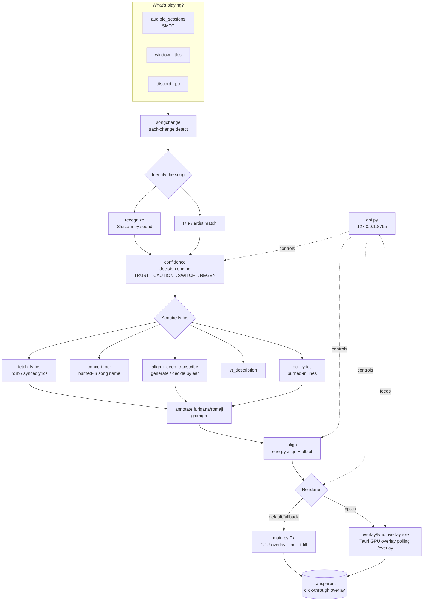

# Deployment Map & Module Guide

A one-stop orientation for a developer: **where everything lives, what each module
does, and how source becomes a running app.** Pairs with
[`ARCHITECTURE.md`](ARCHITECTURE.md) (runtime internals),
[`REPO_ORGANIZATION.md`](REPO_ORGANIZATION.md) (current runtime/data map), and
[`BUILD.md`](BUILD.md) (build minutiae).

---

## 1. Repo layout (top level)

```
Desktop-Karaoke/                      ← SOURCE (git: BarnsL/Lyric-Immersion-and-Karaoke, branch master)
├── main.py                           ← the app: Overlay class, _tick render/sync loop, tray, settings
├── <31 app modules>.py               ← imported at runtime (see the Module Map below)
├── DesktopKaraoke.spec               ← PyInstaller recipe (what gets bundled)
├── build.bat                         ← one-shot build (PyInstaller + optional Inno installer)
├── installer.iss                     ← Inno Setup recipe → dist/…-Setup.exe
├── version.py                        ← single source of the version string
├── requirements.txt
├── scripts/                          ← standalone dev/maintenance scripts (see scripts/README.md)
├── packaging/                        ← MSIX packaging (build_msix.ps1) + after-install text
├── docs/                             ← this folder
├── tests/                            ← test suite
├── spikes/                           ← throwaway proofs-of-concept (e.g. the GPU overlay spike)
├── lyrics/                           ← LOCAL lyric cache (gitignored; copyrighted, never committed)
├── build/  dist/  __pycache__/       ← build output (gitignored)
└── .deps/                            ← vendored faster-whisper stack (gitignored; see BUILD.md)
```

No lyrics ship with the app. `bundled_lyrics/` was removed (TICKET-124): every lyric
is found by code at runtime, never baked into the build.

**Deployed app** lives separately at **`<install-dir>\`** (exe + `_internal/` +
the runtime `lyrics/  models/  settings.json  *.log`). The deploy folder name stays
`DesktopKaraoke` on purpose — renaming it would orphan the lyric cache / models.

---

## 2. Module Map (the 32 root modules, grouped by function)

### App shell
| Module | Role |
|--------|------|
| `main.py` | The whole app: the `Overlay` Tk window, the `_tick` per-frame render + sync loop, the system-tray menu, settings load/save, and spawning/​feeding the child processes (GPU overlay, identify worker, dev console). The ~20.5k-line core everything hangs off. |
| `version.py` | Single source of the version string (read by `api.py`, `updater.py`, the build scripts). |
| `appdata.py` | Resolves the data dir / paths (lyric cache, settings, logs). |
| `api.py` | Local HTTP control API on `127.0.0.1:8765` (`/status /tune /display /subtitles /nudge /resync /decide /scroll ...`) - the "eyes and hands" for driving the app while it runs. |
| `updater.py` | In-app updater (checks GitHub releases, swaps the exe). |
| `tune_docs.py` | Per-knob documentation for the ~230 live-tunable parameters, served by `GET /tune` and shown as tooltips in the dev console (TICKET-212). A separate module because the frozen build has no source for a reader to parse, so inline comments on `Overlay._tune` cannot ship. `scripts/probe_tune_docs.py` enforces exactly one entry per knob. |

### "What's playing?" — sources
| Module | Role |
|--------|------|
| `audible_sessions.py` | Windows **SMTC** media-session reader: title / artist / position / play-state of the actually-audible session. The primary source. |
| `window_titles.py` | Reads browser / app window titles (Steam overlay, Discord, Slack, generic browsers) as a fallback now-playing source. |
| `discord_rpc.py` | Discord Rich Presence as another now-playing source (Spotify etc.). |
| `media_mpris.py` | The **Linux** now-playing provider (MPRIS2 over the D-Bus session bus). Fills the same state contract as the Windows SMTC watcher, so arbitration consumes either unchanged. Polls `Position` (MPRIS omits it from change signals). Needs `dbus-next`; imported by nothing on Windows. See `PORTING.md`. |
| `songchange.py` | Detects track changes (so a new song wipes lyrics and re-identifies). |
| `youtube_music.py` | YouTube Music / CSV playlist helpers. |

### Song identification & decision
| Module | Role |
|--------|------|
| `recognize.py` | **Shazam**-style sound fingerprint ID (`recognize_playing`) — hears the actual audio and names the song + offset. |
| `confidence.py` | Fuses independent signals into the decision engine (TRUST → CAUTION → SWITCH → REGEN), and owns JP-act detection (`_KNOWN_JA`, the single source of truth for "is this a Japanese act"). |
| `deep_transcribe.py` | Whisper transcription used by **decide-by-ear** and sync-by-listening. |
| `llm_disambiguate.py` | **Optional** LLM song disambiguation, gated on an Anthropic API key. Matches a Whisper transcription of the live vocals against candidate lyric bodies to pick the right song, which is more robust than char-level fuzzy matching on a short or ASR-mangled transcript. No key means `available()` is False and every caller falls back to the existing rapidfuzz ranking. Stdlib `urllib` only. |

### Lyric acquisition
| Module | Role |
|--------|------|
| `fetch_lyrics.py` | The lyric providers (lrclib, syncedlyrics, …), the `is_jp_vagency` guards (reject wrong-language bodies for JP acts), and agency-unit extraction (ReGLOSS etc.). |
| `concert_ocr.py` | Reads the **current song name** burned into a concert video's corner, so a live set drives the right song by what's on screen. |
| `ocr_lyrics.py` | OCR of **burned-in lyric lines** (lyric videos / karaoke subs) + the tofu/mojibake strip helpers. |
| `yt_description.py` | Pulls lyrics from the YouTube video description when present. |
| `gairaigo.py` | Loanword (gairaigo) reading table for accurate furigana/romaji of katakana English. |
| `movie_subs.py` | Movie-site subtitle fetcher (TICKET-169). Streaming aggregators play films in embedded players yt-dlp cannot see inside, so Subtitles mode used to dead-end into Whisper on a 110-minute film. This reads the title/year off the watch page, queries the legacy keyless OpenSubtitles REST API, and parses the SRT into the same timed-line shape as captions. Stdlib only; any error returns None and the caller falls back. |

### Sync & metrics
| Module | Role |
|--------|------|
| `align.py` | The alignment engine: energy-correlation align, decide-by-ear, offset measurement, and the whisper deps-path bootstrap. |
| `whisper_worker.py` | Whisper in a **child process**, the crash firewall (TICKET-184). CTranslate2 is native C++, and a CUDA/cuDNN failure (usually VRAM taken by a game) throws on one of its own threads, so the CRT calls `abort()`. Python cannot catch that, so the model runs in a process that is allowed to die: `align.py` starts it over a loopback socket, and on a dead child the parent logs it, drops to CPU, and carries on. |
| `concert_audio.py` | **Offline** concert/live analysis. Real-time ID of a multi-song 3D live is unreliable (Shazam fingerprints a live arrangement against studio recordings, and the live recognize child gets killed by the smoothness backoff on a busy frame), so this analyses a background download of the video's own audio with the whole track in hand. See `CONCERT_AUDIO_SYNC.md`. |
| `metrics.py` | Per-play outcome metrics (one record per song play). |

### Rendering
| Module | Role |
|--------|------|
| `main.py` (Tk path) | The **CPU renderer** — transparent click-through Tk overlay, the scroll belt, the karaoke fill. The default, fully-featured renderer. |
| `overlay/lyric-overlay.exe` | The current **Tauri GPU overlay**. It is bundled by `DesktopKaraoke.spec`, launched by `main.py`, and polls `GET /overlay`. Tk remains visible until this renderer proves it is alive and painting. |
| `gpu_renderer.py` | Legacy retired pygame/moderngl child kept for reference/back-compat stubs. It is not the active GPU renderer. |
| `gpu_setup.py` | Picks the idlest GPU for optional AI/OCR work and exposes GPU diagnostics. |
| `character.py` | The optional on-screen "dancing character" sprite. |

### Library import
| Module | Role |
|--------|------|
| `playlist_import.py` / `playlist_import_gui.py` | Import Spotify / YouTube playlists into the local library. |
| `sync_playlists.py` | Keep imported playlists in sync. |

---

## 3. Build → bundle → deploy → run pipeline

```
                       ┌─────────────────────────────────────────────┐
  EDIT SOURCE          │  <repo>  (git, branch master)   │
  bump version.py +    └───────────────────────┬─────────────────────┘
  installer.iss                                │
                                               ▼
  PRE-BUILD GUARDS      py -3.12 scripts\check_build_deps.py
  (build.bat runs        py -3.12 scripts\check_av_dlls.py
   these for you)       • both REQUIRED. They stop a version-skewed .deps shipping a
                          silently whisper-dead app (see BUILD.md, TICKET-175/176)
                                               │
                                               ▼
  BUILD (PyInstaller)   py -3.12 -m PyInstaller --noconfirm DesktopKaraoke.spec
   • NAME THE INTERPRETER. The build Python is 3.12 and .deps is cp312; the bare
     `python` on the build box is a 3.11 agent venv. The spec REFUSES to build on
     an ABI mismatch (TICKET-196), so a bare `python -m PyInstaller` aborts.
   • run at BelowNormal and, if you pin affinity, keep the build off the
     app's dedicated last-core affinity so it never starves the running app
   • NON-LEAN build: faster-whisper IS bundled (LEAN_BUILD must NOT be 1)
   • whisper is pure-python → lands in the PYZ inside the exe, NOT a
     _internal\faster_whisper dir (its C-deps ctranslate2/av/tokenizers DO appear)
                                               │
                                               ▼
  OUTPUT                dist\DesktopKaraoke\
                          ├── Lyric-Immersion-and-Karaoke.exe
                          └── _internal\   (deps, models, cuda libs, overlay\lyric-overlay.exe, ...)
                                               │
                                               ▼
  POST-BUILD GATES      py -3.12 scripts\check_av_dlls.py --internal dist\DesktopKaraoke
  (build.bat runs        dist\DesktopKaraoke\Lyric-Immersion-and-Karaoke.exe --selftest --out check.txt
   these too)           • REQUIRED before you ship or deploy. The first parses the
                          SHIPPED av\*.pyd import tables and names any missing FFmpeg
                          DLL; the second makes the finished exe import the whole AI
                          stack before any GUI shows and exit non-zero if it can't.
                        • v1.1.74–v1.1.76 shipped with whisper dead and nothing in the
                          log. Do not skip these on a hand-run build.
                                               │
                                               ▼
  DEPLOY (robocopy)     robocopy dist\DesktopKaraoke  <install-dir>  /E
   • DO NOT /MIR and exclude settings.json — preserve the user's
     settings.json + lyrics\ cache + logs (they live in the deploy dir)
   • stop the running exe first (it locks its own files), then relaunch
                                               │
                                               ▼
  RUN                   <install-dir>\Lyric-Immersion-and-Karaoke.exe
   • tray app, transparent overlay, no normal window
   • reads settings.json; if tauri_overlay_on=true, starts overlay\lyric-overlay.exe
     and hands off only after the Tauri window proves it is rendering
   • serves the control API on 127.0.0.1:8765
   • spawns children as needed: recognize.py --child per sound-ID, the whisper
     worker per listen (crash firewall), the dev console from the tray

  INSTALLER (optional)  build.bat also runs Inno (installer.iss) → dist\…-Setup.exe
  MSIX (optional)       packaging\build_msix.ps1  (calls scripts\make_assets.py)
```

### Publishing a GitHub release (REQUIRED asset triplet)

Every release MUST upload **three** assets, or deployed apps cannot auto-update
(the in-app updater self-installs ONLY from the `.zip`; with just a Setup.exe it
silently degrades to opening the Releases page in a browser):

1. `Lyric-Immersion-and-Karaoke-Setup.exe` — first installs (laypeople).
2. `Lyric-Immersion-and-Karaoke-<ver>.zip` — the onedir build zipped (exe at the
   zip root); this is what `updater.py` downloads and swaps in.
3. `Lyric-Immersion-and-Karaoke-<ver>.zip.sha256` — the zip's SHA-256 (bare hex);
   the updater verifies against it fail-closed. build.bat step [4/5] produces both.

```
gh release create vX.Y.Z dist\Lyric-Immersion-and-Karaoke-Setup.exe ^
    dist\Lyric-Immersion-and-Karaoke-X.Y.Z.zip ^
    dist\Lyric-Immersion-and-Karaoke-X.Y.Z.zip.sha256
```

If a raw SHA-256 is printed in the release NOTES, put it on a line that names the
file it belongs to — the updater only trusts a notes hash from a line mentioning
`.zip` (a bare installer hash used to poison the zip verification).

### Gotchas (the ones that have bitten)
- **Never build with `LEAN_BUILD=1`** for a deploy — it silently strips the bundled
  Whisper (AI lyric generation / sync-by-ear). See `BUILD.md`.
- **Never invoke PyInstaller as a bare `python`.** On the build box that resolves to a
  3.11 agent venv while `.deps` is cp312, which produced an app that started fine with a
  silently dead whisper stack and exited 0. Use `py -3.12` (or `build.bat`, which now
  resolves it for you). The spec aborts on a mismatch, so the wrong command fails loudly.
- **Don't skip the guard scripts by building by hand.** `check_build_deps.py` and
  `check_av_dlls.py` run inside `build.bat` only, so a manual PyInstaller run has just
  the spec's ABI check, which sees neither a version skew nor a missing FFmpeg DLL.
- **Build priority / affinity** — the app pins itself to the last cores for
  audio-stutter reasons; keep builds off that dedicated core set and run them at
  `BelowNormal` so they do not starve the live app.
- **robocopy exit code 1-7 = success** (3 = "files copied + extra files present").
  A locked `__mypyc*.pyd` can show a benign non-zero; the exe still copies.
- **GPU renderer today is Tauri**, not the old pygame/moderngl child. If the Tauri
  child fails, the watchdog restores the Tk CPU overlay instead of leaving a
  blank screen.

---

## 4. Runtime architecture



> **There is no separate highlight clock between sync and the renderer.** An earlier
> revision of this diagram drew `main._hi_pos` as a mandatory stage. That slew-limited
> clock was retired: it STARVED the karaoke fill, so the fill went back to the raw song
> clock while the line position eases toward sync. `_hi_pos` is still defined in
> `main.py` and marked in the source as retained for reference with no call site
> ("NOT the retired slew-limited `_hi_pos`"), and its `hi_*` tuning knobs are
> deliberately omitted from the tune dict. Do not put it back in the diagram.
