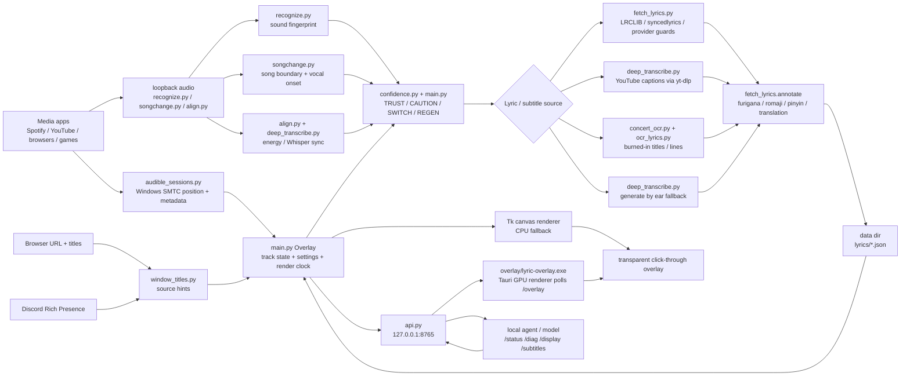

# Repo Organization And Runtime Map

This is the contributor-facing inventory of the app as it runs today. It does
not move modules around; it names clear ownership boundaries so future cleanup
can happen without breaking the PyInstaller bundle or the installed data folder.

## Runtime Diagram

## Source Layout

| Area | Files | Rule of thumb |
|---|---|---|
| App shell | `main.py`, `api.py`, `appdata.py`, `version.py`, `updater.py` | `main.py` owns live state, tray settings, renderer control, and the frame loop. `api.py` is only the local HTTP adapter. |
| Player/source readers | `audible_sessions.py`, `window_titles.py`, `discord_rpc.py`, `media_mpris.py` | These collect evidence about what is playing. They should not decide lyrics by themselves. |
| Song decision | `confidence.py`, `recognize.py`, decision methods inside `main.py` | The player title is a hint; sound and corroborated metadata decide. |
| Lyrics and subtitles | `fetch_lyrics.py`, `deep_transcribe.py`, `yt_description.py`, `ocr_lyrics.py`, `concert_ocr.py`, `gairaigo.py` | These produce timed lines. Subtitle-specific saved files must carry `meta.subtitle=true`. |
| Sync | `align.py`, `songchange.py`, sync methods inside `main.py` | The displayed lyric position eases toward corrections; raw song timing remains the authority for fill. |
| Rendering | Tk code in `main.py`, `character.py`, `overlay/lyric-overlay.exe`, legacy `gpu_renderer.py` | Tk is the guaranteed CPU fallback. The Tauri overlay is the current GPU renderer and is fed by `GET /overlay`. |
| Playlist import | `playlist_import.py`, `playlist_import_gui.py`, `sync_playlists.py`, `youtube_music.py` | Import tools fill the same lyric cache as normal listening. |
| Build and release | `DesktopKaraoke.spec`, `installer.iss`, `build.bat`, `packaging/`, `version_info.txt` | Keep `version.py`, `installer.iss`, and `version_info.txt` in sync for releases. |
| Developer scripts | `scripts/` | Manual maintenance only. See `scripts/README.md`; do not import these from the app. |
| Tests and experiments | `tests/`, `spikes/` | Tests are repeatable; spikes are intentionally throwaway notes/prototypes. |

## Runtime Data Stores

| Store | Location | Contents | Commit policy |
|---|---|---|---|
| Settings | `appdata.data_dir()/settings.json` | Tray settings, display target, subtitle toggles, tune overrides | Local private runtime data. Do not commit user copies. |
| Lyric cache | `appdata.data_dir()/lyrics/*.json` | Timed lyric lines plus `meta` such as title, artist, source, duration, lang | Copyrighted/user-local. Gitignored in the source repo. |
| Subtitle cache | `appdata.data_dir()/lyrics/*-subtitles.json` or older `*.json` with `meta.subtitle=true` | Captions/transcripts edited by the app/API | Kept out of the song index by `LyricsIndex.refresh()`. |
| Logs | `appdata.data_dir()/karaoke.log` and build logs | Diagnostics, decisions, sync changes | Local private runtime data. |
| Models | `appdata.data_dir()/models/` or bundled model paths | Whisper and optional model assets | Large generated/downloaded data, not source. |
| Build output | `build/`, `dist/`, `dist-live/`, installed `<install-dir>` | PyInstaller/Inno artifacts | Regenerate from source; do not hand-edit generated output. |

The codebase does not use a database. "Tables" are Markdown documentation tables,
Python dictionaries, and JSON arrays in the lyric cache. When adding a new dataset,
prefer a named JSON/CSV file under the data directory for user-local data, or a
documented Python table with a comment explaining why it belongs in source.

## How The Installed App Runs

1. `Lyric-Immersion-and-Karaoke.exe` starts the PyInstaller app and imports
   `main.py`.
2. `Overlay.__init__` resolves the data directory, loads `settings.json`,
   enumerates monitors, creates the transparent click-through Tk window, and
   starts watcher threads.
3. The media watcher feeds current title, artist, player position, and status.
4. `_on_track_change` and the decision engine load cached lyrics, fetch captions
   or provider LRCs, or generate/transcribe as a fallback.
5. `_tick` runs continuously. It advances the display clock, applies smooth sync
   correction, updates CPU/Tk rendering, and feeds `/overlay` for Tauri.
6. `api.py`, when enabled, exposes localhost-only inspection and control.
7. If Tauri GPU overlay is enabled, `lyric-overlay.exe` polls `/overlay`; Tk stays
   visible until the GPU overlay proves it is actually rendering.

## Organization Guidelines

- Add new public behavior to docs at the same time as code. Use `docs/USAGE.md`
  for user-facing menu behavior and a focused doc for developer/API behavior.
- Keep app-owned runtime data behind `appdata.py`; do not hard-code local paths.
- Keep subtitle logic explicit: Subtitles mode is user/model toggled, never
  auto-enabled from a website name.
- Keep the Tauri renderer stateless. Python remains the source of truth for
  timing, settings, and subtitles.
- Avoid large physical module moves during release work. A future safe split
  would extract `overlay/subtitles.py`, `overlay/display.py`, `overlay/render.py`,
  and `sync/` from `main.py`, then update `DesktopKaraoke.spec` in the same PR.
