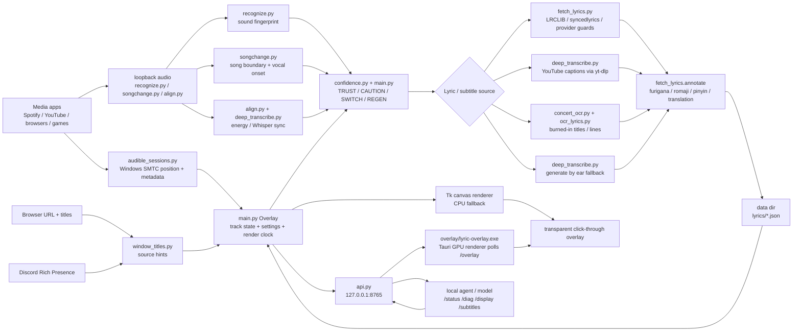

# Repo Organization And Runtime Map

This is the contributor-facing inventory of the app as it runs today. It does
not move modules around; it names clear ownership boundaries so future cleanup
can happen without breaking the PyInstaller bundle or the installed data folder.

## Runtime Diagram



## Source Layout

| Area | Files | Rule of thumb |
|---|---|---|
| App shell | `main.py`, `api.py`, `appdata.py`, `version.py`, `updater.py`, `metrics.py`, `tune_docs.py` | `main.py` owns live state, tray settings, renderer control, and the frame loop. `api.py` is only the local HTTP adapter. `metrics.py` records one per-play outcome record per song. `tune_docs.py` holds the per-knob text for the live-tunable parameters, kept out of `main.py` on purpose. |
| Player/source readers | `audible_sessions.py`, `window_titles.py`, `discord_rpc.py`, `media_mpris.py` | These collect evidence about what is playing. They should not decide lyrics by themselves. |
| Song decision | `confidence.py`, `recognize.py`, `llm_disambiguate.py`, decision methods inside `main.py` | The player title is a hint; sound and corroborated metadata decide. `llm_disambiguate.py` is optional and only runs when an Anthropic API key is present. |
| Lyrics and subtitles | `fetch_lyrics.py`, `deep_transcribe.py`, `yt_description.py`, `ocr_lyrics.py`, `concert_ocr.py`, `movie_subs.py`, `gairaigo.py` | These produce timed lines. Subtitle-specific saved files must carry `meta.subtitle=true`. |
| Sync | `align.py`, `songchange.py`, `concert_audio.py`, sync methods inside `main.py` | The displayed lyric position eases toward corrections; raw song timing remains the authority for fill. `concert_audio.py` is the offline pass for multi-song live/concert audio, where real-time recognition is unreliable. |
| Transcription runtime | `whisper_worker.py`, `gpu_setup.py` | `whisper_worker.py` runs faster-whisper in a child process so a native CTranslate2 crash cannot take the app down (TICKET-184). `gpu_setup.py` downloads the optional CUDA libraries on demand; they are never bundled. |
| Rendering | Tk code in `main.py`, `character.py`, `overlay/lyric-overlay.exe`, retired `gpu_renderer.py` | Tk is the guaranteed CPU fallback. The Tauri overlay is the live GPU path: its tray toggle "GPU overlay (Tauri · smooth, click-through)" is enabled, it runs as an additive second renderer, and it is fed by `GET /overlay`. `gpu_renderer.py` is the retired in-process pygame/moderngl renderer; `Overlay._start_gpu_renderer()` is a no-op stub kept so the old settings key and the child-process entry point stay harmless. |
| Playlist import | `playlist_import.py`, `playlist_import_gui.py`, `sync_playlists.py`, `youtube_music.py` | Import tools fill the same lyric cache as normal listening. |
| Dev console | `dev-console/` | Optional Tauri 2 (React + Vite + TypeScript) developer GUI that reads the localhost API. Sources are committed; its build outputs are gitignored. Bundled by `DesktopKaraoke.spec` only when the release build exists, so a missing exe never breaks a build. |
| Build and release | `DesktopKaraoke.spec`, `installer.iss`, `build.bat`, `packaging/`, `version_info.txt`, `requirements.txt`, `requirements-deps.txt`, `install_extras.bat`, `sign.ps1`, `icon.ico` | Keep `version.py`, `installer.iss`, and `version_info.txt` in sync for releases. `requirements-deps.txt` pins the vendored faster-whisper stack; `sign.ps1` code-signs the exes and the installer. |
| CI and release automation | `.github/workflows/ci.yml`, `.github/workflows/release.yml` | `ci.yml` proves the tree imports on Linux, macOS, and Windows. `release.yml` builds a binary per OS on tag push, because PyInstaller cannot cross-compile. |
| Developer scripts | `scripts/` | Mostly manual maintenance. See `scripts/README.md`. No app module imports from `scripts/`, but CI does run two of them. |
| Tests and experiments | `tests/`, `spikes/`, `research/` | Tests are repeatable; spikes are intentionally throwaway notes/prototypes. `research/` holds the playlist and arm definitions for `scripts/autoresearch.py`. |

The tests are `unittest`-based and `pytest` is not in `requirements.txt`, so the
command that needs no extra dependency is:

```
python -m unittest discover -s tests
```

## Top-Level Directories

Everything that exists at the repo root, including the folders that are present
on a working machine but never committed. Gitignored entries are marked, because
seeing them locally and not in a clean clone is otherwise confusing.

| Entry | Committed? | What it is |
|---|---|---|
| `docs/` | yes | Contributor and user documentation, including this file. |
| `scripts/` | yes | Standalone developer/maintenance scripts. See `scripts/README.md`. |
| `tests/` | yes | `unittest` suite plus `tests/fixtures/`. |
| `spikes/` | yes | Throwaway prototypes kept for their notes, not for reuse. |
| `packaging/` | yes | MSIX packaging: `build_msix.ps1`, `AppxManifest.template.xml`, `after_install.txt`. |
| `dev-console/` | sources only | The Tauri developer console. `node_modules/`, `dist/`, and `src-tauri/target/` are gitignored. |
| `overlay/` | binary present in this tree | Holds the shipped Tauri overlay binary `lyric-overlay.exe`, built by the separate lyric-overlay-tauri project. `DesktopKaraoke.spec` bundles it into a runtime folder also named `overlay`, and `main.py` launches it from there. **This name is taken**; do not add a Python package called `overlay`. |
| `research/` | yes | Inputs for `scripts/autoresearch.py`: `playlist.json` (the known ground-truth playlist) and `arms.json` (the knob configurations to score). Results are written here too. |
| `.github/` | yes | `workflows/ci.yml` and `workflows/release.yml`. |
| `.deps/` | no (gitignored) | Vendored faster-whisper stack, installed with `pip install --target .deps -r requirements-deps.txt` and bundled by the spec. Its presence is what switches `WHISPER` on in `DesktopKaraoke.spec`. |
| `deps/` | no (gitignored) | The optional CUDA runtime that `gpu_setup.py` downloads on demand (roughly 1.9 GB). It lands in `data_dir()/deps`, which is the repo root when running from source. Empty until the user opts in. |
| `models/` | no (gitignored) | Downloaded faster-whisper weights, in the same source-run data directory. |
| `lyrics/` | placeholder only | The lyric cache. `.gitignore` excludes everything except `lyrics/.gitkeep`, because cached lyrics are copyrighted third-party content. |
| `build/`, `dist/` | no (gitignored) | PyInstaller working directory and output, including the released zips and their `.sha256` files. |
| `dist-live/` | no (gitignored) | A second local build tree holding `DesktopKaraoke/` (the exe plus `_internal`). Nothing in the repo references it, so treat it as a developer's local staging copy rather than a step in any documented build. |
| `.claude/` | no (gitignored) | Local agent tooling and worktrees. Machine-local, not part of the product. |
| `__pycache__/` | no (gitignored) | Python bytecode. |

Root files not covered by the Source Layout table: `README.md`, `LICENSE`
(proprietary, all rights reserved), `SECURITY.md` (the privacy and data posture),
`AGENTS.md` (rules for AI agents extending the library, including the hard
no-copyrighted-content rule), `HANDOVER-2026-07-04.md` (a dated point-in-time
handover, not a living document), `.mailmap`, and `.gitignore`. `karaoke.log`,
`metrics.json`, and `settings.json` appear at the root only because a
source run puts the data directory there; all three are gitignored.

## Runtime Data Stores

| Store | Location | Contents | Commit policy |
|---|---|---|---|
| Settings | `appdata.data_dir()/settings.json` | Tray settings, display target, subtitle toggles, tune overrides | Local private runtime data. Do not commit user copies. |
| Lyric cache | `appdata.data_dir()/lyrics/*.json` | Timed lyric lines plus `meta` such as title, artist, source, duration, lang | Copyrighted/user-local. Gitignored in the source repo. |
| Subtitle cache | `appdata.data_dir()/lyrics/*-subtitles.json` or older `*.json` with `meta.subtitle=true` | Captions/transcripts edited by the app/API | Kept out of the song index by `LyricsIndex.refresh()`. |
| Logs | `appdata.data_dir()/karaoke.log` and build logs | Diagnostics, decisions, sync changes | Local private runtime data. |
| Models | `appdata.data_dir()/models/` or bundled model paths | Whisper and optional model assets | Large generated/downloaded data, not source. |
| Build output | `build/`, `dist/`, `dist-live/`, installed `<install-dir>` | PyInstaller/Inno artifacts | Regenerate from source; do not hand-edit generated output. |

The codebase does not use a database. "Tables" are Markdown documentation tables,
Python dictionaries, and JSON arrays in the lyric cache. When adding a new dataset,
prefer a named JSON/CSV file under the data directory for user-local data, or a
documented Python table with a comment explaining why it belongs in source.

## How The Installed App Runs

1. `Lyric-Immersion-and-Karaoke.exe` starts the PyInstaller app and imports
   `main.py`.
2. `Overlay.__init__` resolves the data directory, loads `settings.json`,
   enumerates monitors, creates the transparent click-through Tk window, and
   starts watcher threads.
3. The media watcher feeds current title, artist, player position, and status.
4. `_on_track_change` and the decision engine load cached lyrics, fetch captions
   or provider LRCs, or generate/transcribe as a fallback.
5. `_tick` runs continuously. It advances the display clock, applies smooth sync
   correction, updates CPU/Tk rendering, and feeds `/overlay` for Tauri.
6. `api.py`, when enabled, exposes localhost-only inspection and control.
7. If Tauri GPU overlay is enabled, `lyric-overlay.exe` polls `/overlay`; Tk stays
   visible until the GPU overlay proves it is actually rendering.

## Organization Guidelines

- Add new public behavior to docs at the same time as code. Use `docs/USAGE.md`
  for user-facing menu behavior and a focused doc for developer/API behavior.
- Keep app-owned runtime data behind `appdata.py`; do not hard-code local paths.
- Keep subtitle logic explicit: Subtitles mode is user/model toggled, never
  auto-enabled from a website name.
- Keep the Tauri renderer stateless. Python remains the source of truth for
  timing, settings, and subtitles.
- Avoid large physical module moves during release work. A future safe split
  would extract `ui/subtitles.py`, `ui/display.py`, `ui/render.py`, and `sync/`
  from `main.py`, then update `DesktopKaraoke.spec` in the same PR. Note the
  namespace: an earlier version of this doc proposed `overlay/` for that split,
  but `overlay/` is already a real directory holding the shipped Tauri binary
  `lyric-overlay.exe`, and the spec bundles it to a runtime path of the same
  name. A Python package called `overlay` would collide with both. `ui/` and
  `sync/` are free today; confirm that before you start.
